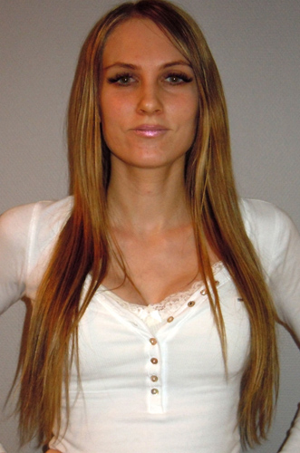

---
titleBreadcrumb: Home
...
En kort presentation om mig
===============================

<figure class="right top">

</figure>

Mitt namn är Louise. Jag är 27år och bor i Hässleholm. Jag har ett eget webbdesignföretag
och läser detta program då jag vill utöka mina kunskaper med webbprogrammering och kanske
även arbeta med IT på ett företag efter avslutad utbildning. Jag startade företaget strax
efter att jag avslutat min första webbdesignutbildning. Sedan dess har jag gått flertalet
utbildningar och kurser inom html, css, php och javascript. Utöver detta program har jag
även ett års ekonomistudier på högskolan samt att jag läst flera kurser inom webbdesign tidigare.

Jag arbetar även extra som kundtjänstmedarbetare.

Då jag inte arbetar eller studerar umgås jag helst med familj och vänner eller tränar. Jag har under många år spelat tennis.
